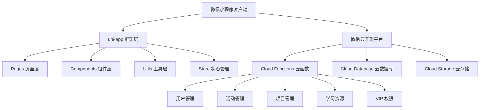

<div align="center">

# 🚀 Startupilot 微信小程序

<p align="center">
  <strong>创业者赋能社群 - 一站式创业服务平台</strong>
</p>

<p align="center">
  活动预约 · 学习资源 · 项目对接 · VIP 会员体系
</p>

[](https://opensource.org/licenses/MIT)
[](https://uniapp.dcloud.io/)
[](https://vuejs.org/)
[](https://developers.weixin.qq.com/miniprogram/dev/framework/)

</div>

---

## 📑 目录

- [项目简介](#-项目简介)
- [核心特性](#-核心特性)
- [技术栈](#-技术栈)
- [项目结构](#-项目结构)
- [快速开始](#-快速开始)
- [功能模块详解](#-功能模块详解)
- [云开发配置](#-云开发配置)
- [开发指南](#-开发指南)
- [部署与发布](#-部署与发布)
- [常见问题](#-常见问题)
- [文档体系](#-文档体系)
- [贡献指南](#-贡献指南)
- [许可证](#-许可证)

---

## 🎯 项目简介

### 项目背景

**Startupilot** 是一个面向创业者的一站式服务平台，致力于为早期创业者、投资人、产业合伙人及创业导师提供全方位的创业支持服务。通过微信小程序的形式，降低使用门槛，让创业服务触手可及。

本项目采用 **uni-app + 微信云开发** 的现代化技术方案，充分利用 Serverless 架构的优势，实现快速开发、低成本维护和高可用性的目标。

### 目标用户

- 🎓 **早期创业者 / 创业团队** - 寻求资源和指导
- 💼 **投资人 / 产业合伙人** - 发掘优质项目
- 🧑‍🏫 **企业顾问 / 创业导师** - 分享经验和资源
- 📚 **创业学习者** - 获取知识和案例

### 核心价值

- ✅ **资源聚合** - 整合创业活动、学习资源与项目对接
- ✅ **会员体系** - 提供差异化服务，提高用户黏性
- ✅ **数据沉淀** - 构建可复用的创业知识网络
- ✅ **社群连接** - 打通创业生态各环节

### 项目状态

| 状态 | 说明 |
|------|------|
| ✅ 需求与原型 | 已完成主要业务流程的原型设计与交互稿 |
| ✅ 技术方案 | 已确定 uni-app + 微信云开发的整体架构 |
| ✅ 核心开发 | 已完成页面、组件、云函数与数据库设计 |
| ✅ UI/UX 优化 | 已实现玻璃态设计、动态按钮、卡片阴影增强 |
| ✅ SOP文档 | 已完成完整的标准操作程序文档体系 |
| 🚧 测试优化 | 进行中，参考测试与质量保障文档 |
| ⏳ 发布运营 | 待执行，参考部署与发布流程文档 |

---

## ✨ 核心特性

### 🎪 活动预约系统
- 📅 活动列表展示（线上/线下标签）
- 📝 活动详情查看（时间、地点、人数限制）
- ✅ 活动报名 / 取消报名
- 📋 我的报名记录管理

### 📚 学习资源中心
- 🗂️ 资源分类（案例分析、管理工具等）
- 🔍 搜索过滤功能
- ⭐ 收藏功能
- 🔒 VIP 权限控制
- 📥 资源下载（NEO 会员专属）

### 🤝 项目对接广场
- ✍️ 发布项目需求
- 🏷️ 项目筛选（类型、标签、关键字）
- 📱 联系项目方
- 📊 我的发布管理
- 🛡️ 内容安全审核（微信 msgSecCheck）

### 👤 会员权益系统
- 🎫 VIP 会员体系（普通 / NEO）
- 🎁 兑换码激活
- 💎 差异化权益控制
- 📈 数据统计（收藏、发布、报名）
- ✨ NEO 会员动态卡片（炫光效果）

### 🎨 UI/UX 特色
- 🌈 **玻璃态设计** - 现代感的毛玻璃效果
- 🎯 **三色渐变按钮** - 统一的品牌视觉
- 💫 **动态炫光效果** - NEO 会员卡片特效
- 🃏 **深度卡片阴影** - 增强视觉层次
- 📱 **响应式布局** - 适配不同设备

---

## 🛠️ 技术栈

### 前端技术

| 技术 | 版本 | 说明 |
|------|------|------|
| **uni-app** | 3.0.0-alpha | 跨平台应用开发框架 |
| **Vue** | 3.5.24 | 渐进式 JavaScript 框架 |
| **Pinia** | 2.1.7 | Vue 状态管理库 |
| **Vite** | 5.2.8 | 下一代前端构建工具 |
| **SCSS** | 1.69.5 | CSS 预处理器 |

### 后端技术

- **微信云开发** - Serverless 后端服务
  - Cloud Functions - 云函数
  - Cloud Database - 云数据库
  - Cloud Storage - 云存储

### 开发工具

- **HBuilderX / VS Code** - 代码编辑器
- **微信开发者工具** - 小程序调试
- **Git** - 版本控制

### 架构特点



---

## 📁 项目结构

```bash
startupilot-miniapp/
├── 📁 pages/                      # 页面目录
│   ├── index/                     # 首页（活动推荐、FAQ）
│   ├── learning/                  # 学习资源页
│   ├── projects/                  # 项目广场页
│   ├── profile/                   # 个人中心页
│   └── admin/                     # 管理员页面
│       ├── redeem-codes           # 兑换码管理
│       ├── projects-admin         # 项目管理
│       ├── bookings               # 预约管理
│       └── publish-permissions    # 发布权限管理
│
├── 📁 subPackages/                # 分包目录
│   ├── profile/                   # 个人中心分包
│   │   ├── favorites/             # 我的收藏
│   │   ├── posts/                 # 我的发布
│   │   ├── registrations/         # 我的报名
│   │   └── settings/              # 设置与条款
│   └── projects/                  # 项目分包
│       └── publish/               # 发布项目
│
├── 📁 components/                 # 组件目录
│   ├── glass-card/                # 玻璃卡片组件
│   ├── glass-button/              # 玻璃按钮组件
│   ├── event-card/                # 活动卡片组件
│   ├── learning-card/             # 学习卡片组件
│   ├── project-card/              # 项目卡片组件
│   ├── empty-state/               # 空状态组件
│   ├── loading/                   # 加载组件
│   ├── skeleton/                  # 骨架屏组件
│   ├── customer-service/          # 客服组件
│   └── modals/                    # 弹窗组件集合
│
├── 📁 cloudfunctions/             # 云函数目录
│   ├── user/                      # 用户相关云函数
│   ├── event/                     # 活动相关云函数
│   ├── project/                   # 项目相关云函数
│   ├── learning/                  # 学习资源云函数
│   ├── favorite/                  # 收藏云函数
│   ├── vip/                       # VIP 相关云函数
│   ├── admin/                     # 管理员云函数
│   ├── login/                     # 登录云函数
│   └── common/                    # 通用云函数
│
├── 📁 store/                      # 状态管理
│   ├── index.js                   # Store 入口
│   ├── user.js                    # 用户状态
│   ├── event.js                   # 活动状态
│   └── project.js                 # 项目状态
│
├── 📁 utils/                      # 工具函数
│   ├── request.js                 # 网络请求封装
│   ├── auth.js                    # 认证工具
│   ├── storage.js                 # 本地存储
│   ├── validator.js               # 数据验证
│   ├── logger.js                  # 日志工具
│   ├── constants.js               # 常量定义
│   ├── cloud-storage.js           # 云存储工具
│   ├── analytics.js               # 数据分析
│   ├── performance.js             # 性能监控
│   ├── error-handler.js           # 错误处理
│   ├── feedback.js                # 用户反馈
│   ├── device.js                  # 设备信息
│   ├── share-presets.js           # 分享预设
│   └── customer-service-config.js # 客服配置
│
├── 📁 composables/                # 组合式函数
│   ├── useShare.js                # 分享功能
│   ├── useSafeAsync.js            # 安全异步处理
│   └── ...
│
├── 📁 styles/                     # 全局样式
│   ├── variables.scss             # 变量定义
│   ├── common.scss                # 通用样式
│   ├── mixins.scss                # 混入
│   └── animations.scss            # 动画
│
├── 📁 static/                     # 静态资源
│   ├── tabbar/                    # 底部导航图标
│   ├── images/                    # 图片资源
│   └── icons/                     # 图标资源
│
├── 📁 api/                        # API 接口封装
├── 📁 mixins/                     # 混入
├── 📁 scripts/                    # 脚本工具
├── 📄 App.vue                     # 根组件
├── 📄 main.js                     # 入口文件
├── 📄 manifest.json               # 应用配置
├── 📄 pages.json                  # 页面路由配置
├── 📄 uni.scss                    # uni-app 样式变量
├── 📄 vite.config.js              # Vite 配置
└── 📄 package.json                # 项目依赖
```

### 核心文件说明

- **App.vue** - 应用入口，初始化云开发环境（`cloud1-3gx5i5y8f78c0ac6`）
- **pages.json** - 定义页面路由、TabBar、分包策略
- **manifest.json** - 小程序基础配置（AppID、权限等）
- **vite.config.js** - 构建配置与优化

---

## 🚀 快速开始

### 环境准备

#### 1. 安装依赖工具

```bash
# 确保安装 Node.js (建议 16.x 或更高版本)
node -v

# 确保安装 npm
npm -v
```

#### 2. 安装开发工具

- **代码编辑器**: [VS Code](https://code.visualstudio.com/) (推荐) 或 [HBuilderX](https://www.dcloud.io/hbuilderx.html)
- **微信开发者工具**: [下载地址](https://developers.weixin.qq.com/miniprogram/dev/devtools/download.html)

#### 3. VS Code 插件（推荐）

- **Volar** - Vue 3 官方插件
- **ESLint** - 代码检查
- **SCSS IntelliSense** - SCSS 智能提示

### 克隆项目

```bash
# 克隆仓库
git clone https://github.com/ALEX152834/Startupilot-.git

# 进入项目目录
cd startupilot-miniapp

# 安装依赖
npm install
```

### 基础配置

#### 1. 配置小程序 AppID

编辑 `manifest.json`，替换为你的小程序 AppID：

```json
{
  "mp-weixin": {
    "appid": "your-appid-here"
  }
}
```

#### 2. 配置云开发环境 ID

编辑 `App.vue`，替换云开发环境 ID：

```javascript
const DEFAULT_CLOUD_ENV_ID = 'your-cloud-env-id'
```

或者创建 `.env` 文件：

```env
VITE_CLOUD_ENV_ID=your-cloud-env-id
```

### 启动开发环境

#### 1. 编译项目

```bash
# 启动微信小程序开发模式
npm run dev:mp-weixin
```

#### 2. 打开微信开发者工具

1. 打开微信开发者工具
2. 导入项目，选择 `dist/dev/mp-weixin` 目录
3. 等待编译完成

#### 3. 开通云开发

1. 在微信开发者工具顶部菜单点击 **"云开发"**
2. 点击 **"开通"** 按钮
3. 创建一个云开发环境
4. 记录环境 ID，更新到 `App.vue` 中

### 初始化数据库

#### 1. 创建数据库集合

在微信开发者工具的云开发控制台，创建以下集合：

| 集合名称 | 说明 | 权限设置 |
|---------|------|---------|
| `users` | 用户信息 | 仅创建者可读写 |
| `events` | 活动信息 | 所有用户可读，仅管理员可写 |
| `projects` | 项目信息 | 所有用户可读，仅创建者可写 |
| `resources` | 学习资源 | 所有用户可读，仅管理员可写 |
| `bookings` | 活动预约 | 仅创建者可读写 |
| `favorites` | 收藏记录 | 仅创建者可读写 |
| `vip_codes` | VIP 兑换码 | 仅管理员可读写 |

#### 2. 创建数据库索引

为提高查询性能，建议创建以下索引：

**users 集合**
```javascript
{ "openid": 1 }  // 唯一索引
{ "isVip": 1, "vipExpireTime": 1 }
```

**events 集合**
```javascript
{ "startTime": -1 }
{ "status": 1, "startTime": -1 }
```

**projects 集合**
```javascript
{ "createdAt": -1 }
{ "category": 1, "createdAt": -1 }
{ "publisherId": 1, "createdAt": -1 }
```

**resources 集合**
```javascript
{ "category": 1 }
{ "requireVip": 1, "createdAt": -1 }
```

### 部署云函数

#### 1. 上传云函数

在微信开发者工具的云开发控制台：

1. 点击 **"云函数"** 标签
2. 右键点击本地云函数目录
3. 选择 **"创建并部署：云端安装依赖"**

需要部署的云函数列表：
- ✅ `user` - 用户管理
- ✅ `event` - 活动管理
- ✅ `project` - 项目管理
- ✅ `learning` - 学习资源
- ✅ `favorite` - 收藏管理
- ✅ `vip` - VIP 权限
- ✅ `admin` - 管理员功能
- ✅ `login` - 登录认证
- ✅ `common` - 通用工具

#### 2. 配置云函数环境变量（可选）

某些云函数可能需要环境变量，在云函数配置中添加。

### 验证安装

#### 1. 测试登录功能

- 点击 "获取手机号" 按钮
- 查看是否能成功登录
- 检查用户信息是否正确显示

#### 2. 测试数据读取

- 浏览活动列表
- 浏览学习资源
- 浏览项目广场

#### 3. 测试功能权限

- 测试普通用户权限
- 测试 VIP 用户权限
- 测试管理员权限

---

## 📱 功能模块详解

### 1️⃣ 首页（Home）

**页面路径**: `pages/index/index.vue`

**主要功能**:
- 🎪 活动推荐与展示
- 📖 关于 Startupilot 介绍
- ❓ 常见问题（FAQ）
- 🎯 快速导航入口

**技术要点**:
- 使用玻璃态卡片组件 (`glass-card`)
- 渐变按钮统一视觉风格
- 骨架屏优化加载体验

### 2️⃣ 学习资源（Learning）

**页面路径**: `pages/learning/learning.vue`

**主要功能**:
- 📚 资源分类浏览（案例分析、管理工具等）
- 🔍 搜索与过滤功能
- ⭐ 收藏 / 取消收藏
- 🔒 VIP 权限控制
- 📥 资源下载（NEO 会员专属）

**数据模型**:
```javascript
{
  _id: String,
  title: String,         // 资源标题
  category: String,      // 分类
  description: String,   // 描述
  requireVip: Boolean,   // 是否需要 VIP
  fileUrl: String,       // 文件地址
  coverImage: String,    // 封面图
  createdAt: Date
}
```

**云函数**: `learning`
- `getResources` - 获取资源列表
- `getResourceDetail` - 获取资源详情
- `downloadResource` - 下载资源（VIP检查）

### 3️⃣ 项目广场（Projects）

**页面路径**: `pages/projects/projects.vue`

**主要功能**:
- 📝 发布项目需求
- 🏷️ 项目筛选（类型、标签、关键字）
- 👁️ 查看项目详情
- 📱 联系项目方
- 📊 我的发布管理

**数据模型**:
```javascript
{
  _id: String,
  title: String,         // 项目标题
  category: String,      // 项目类型
  description: String,   // 项目描述
  tags: Array,           // 标签
  contactInfo: String,   // 联系方式
  publisherId: String,   // 发布者ID
  publisher: Object,     // 发布者信息（聚合查询）
  status: String,        // 状态
  createdAt: Date
}
```

**云函数**: `project`
- `getProjects` - 获取项目列表（聚合查询，带发布人信息）
- `getProjectDetail` - 获取项目详情
- `publishProject` - 发布项目（内容安全检查）
- `deleteProject` - 删除项目

**技术亮点**:
- 使用 `aggregate + lookup` 聚合查询，避免 N+1 问题
- 接入微信内容安全 API (`msgSecCheck`) 进行敏感内容过滤

### 4️⃣ 个人中心（Profile）

**页面路径**: `pages/profile/profile.vue`

**主要功能**:
- 👤 用户信息展示
- 💎 VIP 会员卡片（NEO 会员卡带动态炫光效果）
- 📈 数据统计（收藏数、发布数、报名数）
- 🔗 功能入口：
  - 我的收藏
  - 我的发布
  - 我的报名
  - 设置与条款
  - 联系我们
  - 公众号二维码

**VIP 会员体系**:

| 会员类型 | 权限 |
|---------|------|
| 普通会员 | 浏览资源、报名活动、发布项目 |
| NEO 会员 | 普通会员权限 + 下载高级资源 + 专享标识 |

**子页面**:

##### 我的收藏
- 路径: `subPackages/profile/favorites/favorites.vue`
- 功能: 查看收藏的学习资源
- 空状态引导: "去逛逛" 跳转到学习页

##### 我的发布
- 路径: `subPackages/profile/posts/posts.vue`
- 功能: 管理发布的项目
- 支持删除、编辑

##### 我的报名
- 路径: `subPackages/profile/registrations/registrations.vue`
- 功能: 查看报名的活动
- 支持取消报名

##### 设置与条款
- 路径: `subPackages/profile/settings/settings.vue`
- 功能: 隐私政策、用户协议查看

### 5️⃣ 管理员功能

**页面路径**: `pages/admin/`

仅管理员可访问，提供后台管理能力：

##### 兑换码管理
- 路径: `pages/admin/redeem-codes.vue`
- 功能: 生成、查看、删除 VIP 兑换码

##### 项目管理
- 路径: `pages/admin/projects-admin.vue`
- 功能: 审核、删除用户发布的项目

##### 预约管理
- 路径: `pages/admin/bookings.vue`
- 功能: 查看活动预约情况、导出数据

##### 发布权限管理
- 路径: `pages/admin/publish-permissions.vue`
- 功能: 控制用户发布权限

---

## ☁️ 云开发配置

### 云函数列表

#### 1. user - 用户管理

**功能**:
- 获取用户信息
- 更新用户资料
- 获取用户统计数据（收藏、发布、报名数）

**主要接口**:
```javascript
// 获取当前用户信息
cloud.callFunction({
  name: 'user',
  data: { action: 'getInfo' }
})

// 获取统计数据
cloud.callFunction({
  name: 'user',
  data: { action: 'getStats' }
})
```

#### 2. event - 活动管理

**功能**:
- 获取活动列表
- 获取活动详情
- 报名活动
- 取消报名

**主要接口**:
```javascript
// 获取活动列表
cloud.callFunction({
  name: 'event',
  data: {
    action: 'getEvents',
    page: 1,
    pageSize: 10
  }
})

// 报名活动
cloud.callFunction({
  name: 'event',
  data: {
    action: 'book',
    eventId: 'xxx'
  }
})
```

#### 3. project - 项目管理

**功能**:
- 获取项目列表（聚合查询）
- 发布项目（内容安全检查）
- 删除项目

**技术亮点**:
```javascript
// 使用聚合查询获取项目列表（带发布人信息）
const result = await db.collection('projects')
  .aggregate()
  .lookup({
    from: 'users',
    localField: 'publisherId',
    foreignField: 'openid',
    as: 'publisher'
  })
  .end()

// 发布项目时进行内容安全检查
const checkResult = await cloud.openapi.security.msgSecCheck({
  version: 2,
  scene: 2,
  openid: event.userInfo.openId,
  content: content
})
```

#### 4. learning - 学习资源

**功能**:
- 获取资源列表
- 获取资源详情
- 下载资源（VIP 权限检查）

#### 5. favorite - 收藏管理

**功能**:
- 添加收藏
- 取消收藏
- 获取收藏列表

#### 6. vip - VIP 管理

**功能**:
- 兑换 VIP 码
- 检查 VIP 状态
- 生成兑换码（管理员）

#### 7. admin - 管理员功能

**功能**:
- 管理兑换码
- 审核项目
- 查看预约数据
- 权限控制

#### 8. login - 登录认证

**功能**:
- 微信登录
- 获取手机号
- 创建/更新用户信息

### 云数据库权限配置

建议在云开发控制台配置以下权限规则：

```javascript
// users 集合
{
  "read": "doc.openid == auth.openid",
  "write": "doc.openid == auth.openid"
}

// events 集合
{
  "read": true,
  "write": false  // 仅通过云函数写入
}

// projects 集合
{
  "read": true,
  "write": "doc.publisherId == auth.openid"
}

// resources 集合
{
  "read": true,
  "write": false  // 仅通过云函数写入
}

// bookings 集合
{
  "read": "doc.userId == auth.openid",
  "write": "doc.userId == auth.openid"
}

// favorites 集合
{
  "read": "doc.userId == auth.openid",
  "write": "doc.userId == auth.openid"
}

// vip_codes 集合
{
  "read": false,
  "write": false  // 仅通过云函数操作
}
```

---

## 💻 开发指南

### 代码规范

#### 1. 命名规范

- **文件名**: 使用 kebab-case，如 `glass-card.vue`
- **组件名**: 使用 PascalCase，如 `<GlassCard />`
- **变量名**: 使用 camelCase，如 `userName`
- **常量名**: 使用 UPPER_SNAKE_CASE，如 `API_BASE_URL`

#### 2. 组件开发规范

```vue
<template>
  <!-- 模板 -->
</template>

<script setup>
// 1. 导入依赖
import { ref, computed } from 'vue'
import { useUserStore } from '@/store/user'

// 2. Props 定义
const props = defineProps({
  title: String,
  required: Boolean
})

// 3. Emits 定义
const emit = defineEmits(['update', 'close'])

// 4. 响应式数据
const count = ref(0)

// 5. 计算属性
const doubleCount = computed(() => count.value * 2)

// 6. 方法
const handleClick = () => {
  count.value++
  emit('update', count.value)
}

// 7. 生命周期钩子
onMounted(() => {
  console.log('组件已挂载')
})
</script>

<style lang="scss" scoped>
// 样式
</style>
```

#### 3. 样式规范

使用 SCSS 变量和混入：

```scss
// 使用全局变量
@import '@/styles/variables.scss';

.my-component {
  background: $bg-color;
  padding: $spacing-lg;
  
  // 使用混入
  @include glass-effect;
  @include flex-center;
}
```

#### 4. API 调用规范

```javascript
import { request } from '@/utils/request'

// 统一使用封装的 request 方法
const getEventList = async (page = 1) => {
  try {
    const res = await request({
      name: 'event',
      data: {
        action: 'getEvents',
        page
      }
    })
    return res.data
  } catch (error) {
    console.error('获取活动列表失败', error)
    throw error
  }
}
```

### 状态管理

使用 Pinia 进行状态管理：

```javascript
// store/user.js
import { defineStore } from 'pinia'

export const useUserStore = defineStore('user', {
  state: () => ({
    userInfo: null,
    isLogin: false,
    stats: {
      favoritesCount: 0,
      postsCount: 0,
      bookingsCount: 0
    }
  }),
  
  getters: {
    isVip: (state) => state.userInfo?.isVip || false,
    vipLevel: (state) => state.userInfo?.vipLevel || 'normal'
  },
  
  actions: {
    async login() {
      // 登录逻辑
    },
    
    async fetchStats() {
      // 获取统计数据
    }
  }
})
```

### 组合式函数（Composables）

#### useShare - 分享功能

```javascript
import { useShare } from '@/composables/useShare'

// 在页面中使用
const { setupShare } = useShare()

onMounted(() => {
  setupShare({
    title: '创业者-赋能社群',
    path: '/pages/index/index',
    imageUrl: '/static/share/index.png'
  })
})
```

#### useSafeAsync - 安全异步处理

```javascript
import { useSafeAsync } from '@/composables/useSafeAsync'

const { execute, loading, error } = useSafeAsync(async () => {
  const res = await fetchData()
  return res
})

// 执行异步操作
await execute()
```

### 性能优化建议

#### 1. 分包加载

在 `pages.json` 中配置分包：

```json
{
  "subPackages": [
    {
      "root": "subPackages/profile",
      "pages": [...]
    }
  ],
  "preloadRule": {
    "pages/index/index": {
      "network": "all",
      "packages": ["subPackages/profile"]
    }
  }
}
```

#### 2. 图片优化

- 使用 WebP 格式
- 压缩图片大小
- 使用云存储 CDN

#### 3. 数据缓存

```javascript
import { storage } from '@/utils/storage'

// 缓存数据
storage.set('events', eventList, 3600) // 缓存 1 小时

// 读取缓存
const cachedEvents = storage.get('events')
```

#### 4. 列表优化

- 使用虚拟列表
- 分页加载
- 骨架屏占位

---

## 🚀 部署与发布

### 环境划分

| 环境 | 云开发环境 | 用途 |
|------|-----------|------|
| **开发环境** | dev-xxx | 本地开发调试 |
| **测试环境** | test-xxx | 功能测试 |
| **预发布环境** | pre-xxx | 上线前验证 |
| **生产环境** | prod-xxx | 正式运营 |

### 发布流程

#### 1. 构建生产版本

```bash
# 构建小程序生产版本
npm run build:mp-weixin
```

#### 2. 上传代码

1. 打开微信开发者工具
2. 点击顶部菜单 **"上传"**
3. 填写版本号和备注
4. 点击上传

#### 3. 提交审核

1. 登录[微信公众平台](https://mp.weixin.qq.com/)
2. 进入 **"开发管理"** → **"版本管理"**
3. 选择开发版本，点击 **"提交审核"**
4. 填写审核信息：
   - 测试账号（如需要）
   - 功能描述
   - 类目资质

#### 4. 发布上线

审核通过后：
1. 在版本管理页面点击 **"发布"**
2. 确认发布信息
3. 发布成功

### 上线前检查清单

- [ ] 代码质量检查（ESLint）
- [ ] 功能完整性测试
- [ ] 不同设备兼容性测试
- [ ] 云函数已部署到生产环境
- [ ] 数据库权限配置正确
- [ ] 敏感信息已移除（AppID、密钥等使用环境变量）
- [ ] 隐私政策和用户协议已更新
- [ ] 分享图片和文案已配置
- [ ] 客服联系方式已配置
- [ ] 版本号已更新

详细检查清单参考: `LAUNCH_CHECKLIST.md`

---

## ❓ 常见问题

### Q1: 云开发初始化失败？

**解决方案**:
1. 检查云开发环境 ID 是否正确
2. 确认已在微信开发者工具中开通云开发
3. 检查 `App.vue` 中的环境 ID 配置

```javascript
// App.vue
const DEFAULT_CLOUD_ENV_ID = 'your-cloud-env-id' // 替换为你的环境 ID
```

### Q2: 云函数调用失败？

**解决方案**:
1. 确认云函数已正确部署
2. 检查云函数权限配置
3. 查看云函数日志排查错误
4. 确认云函数名称拼写正确

```javascript
// 正确的云函数调用方式
const res = await wx.cloud.callFunction({
  name: 'user',  // 确认云函数名称
  data: {
    action: 'getInfo'
  }
})
```

### Q3: 登录失败或无法获取手机号？

**解决方案**:
1. 确认在微信公众平台配置了服务器域名
2. 检查 `open-type="getPhoneNumber"` 是否正确
3. 确认已部署 `login` 云函数
4. 检查用户是否授权

### Q4: VIP 权限不生效？

**解决方案**:
1. 检查用户 VIP 状态是否正确
2. 确认 VIP 过期时间
3. 检查云函数中的权限判断逻辑
4. 清除缓存重新登录

### Q5: 分享功能不正常？

**解决方案**:
1. 确认 `useShare` composable 已正确导入
2. 检查分享图片路径是否正确（必须是绝对路径）
3. 图片大小建议 5:4 比例，小于 128KB
4. 检查页面路径是否正确

```javascript
// 正确的分享配置
setupShare({
  title: '创业者-赋能社群',
  path: '/pages/index/index',  // 必须以 / 开头
  imageUrl: '/static/share/index.png'  // 绝对路径
})
```

### Q6: 内容安全检查失败？

**解决方案**:
1. 确认已开通内容安全 API
2. 检查敏感词过滤
3. 优化检查参数配置

```javascript
// 内容安全检查
const checkResult = await cloud.openapi.security.msgSecCheck({
  version: 2,
  scene: 2,
  openid: event.userInfo.openId,
  content: content
})
```

### Q7: 玻璃态效果不显示？

**解决方案**:
1. 确认 SCSS 变量已正确导入
2. 检查 backdrop-filter 浏览器兼容性
3. 确认父元素有背景

```scss
@import '@/styles/variables.scss';

.glass-card {
  @include glass-effect;
}
```

### Q8: 数据查询慢？

**解决方案**:
1. 为常用查询字段创建索引
2. 使用聚合查询减少查询次数
3. 添加分页加载
4. 实现数据缓存

```javascript
// 创建索引示例
db.collection('events').createIndex({
  keys: { startTime: -1 },
  unique: false
})
```

---

## 📚 文档体系

### 文档分层架构

```
文档体系
├── 项目仓库文档               # 本仓库内文档
│   ├── README.md              # 项目总览（本文档）
│   ├── QUICK_START.md         # 快速开始指南
│   ├── DEVELOPMENT.md         # 开发规范
│   ├── DEPLOYMENT.md          # 部署流程
│   ├── TESTING.md             # 测试指南
│   ├── LAUNCH_CHECKLIST.md    # 上线检查清单
│   └── ...                    # 其他文档
│
└── SOP文档体系                  # 团队标准操作程序
    ├── 01_项目总览.md         # 项目定位与背景
    ├── 02_原型与交互设计.md    # 设计规范
    ├── 03_技术架构与数据流程.md # 技术架构
    ├── 04-13...              # 其他SOP文档
    └── README.md             # SOP文档索引
```

### 仓库文档

本仓库提供完整的开发文档：

| 文档 | 说明 |
|------|------|
| [README.md](./README.md) | 项目总览（本文档） |
| [QUICK_START.md](./QUICK_START.md) | 快速开始指南 |
| [DEVELOPMENT.md](./DEVELOPMENT.md) | 开发规范与指南 |
| [DEPLOYMENT.md](./DEPLOYMENT.md) | 部署流程说明 |
| [TESTING.md](./TESTING.md) | 测试指南 |
| [LAUNCH_CHECKLIST.md](./LAUNCH_CHECKLIST.md) | 上线检查清单 |
| [DATA_EXPORT_GUIDE.md](./DATA_EXPORT_GUIDE.md) | 数据导出指南 |
| [CLOUD_STORAGE_QUICK_REFERENCE.md](./CLOUD_STORAGE_QUICK_REFERENCE.md) | 云存储使用参考 |
| [ENV_CONFIG.md](./ENV_CONFIG.md) | 环境配置说明 |
| [PRIVACY_POLICY.md](./PRIVACY_POLICY.md) | 隐私政策 |
| [USER_AGREEMENT.md](./USER_AGREEMENT.md) | 用户协议 |
| [CHANGELOG.md](./CHANGELOG.md) | 版本更新记录 |

### SOP 文档体系

团队内部完整 SOP 文档（位于 `C:/Users/Administrator/Desktop/SOP文档/`）：

| 编号 | 文档 | 说明 | 优先级 |
|------|------|------|--------|
| 01 | 项目总览.md | 项目背景、目标用户、核心功能模块、产品架构 | ⭐⭐⭐ 必读 |
| 02 | 原型与交互设计.md | 信息架构、页面原型、交互规范、设计系统 | ⭐⭐⭐ 必读 |
| 03 | 技术架构与数据流程.md | 前后端架构、数据流程图、状态管理、云函数调用流程 | ⭐⭐⭐ 必读 |
| 04 | 开发环境与目录结构.md | 环境配置、目录结构、快速启动指南、依赖管理 | ⭐⭐⭐ 必读 |
| 05 | 开发规范与代码风格.md | 编码规范、命名约定、Vue组件规范、性能优化 | ⭐⭐ 重要 |
| 06 | 云开发配置与数据库设计.md | 数据库集合设计、字段定义、索引策略、权限规则 | ⭐⭐ 重要 |
| 07 | API与数据模型说明.md | 云函数API文档、请求/响应格式、错误码定义 | ⭐⭐ 重要 |
| 08 | 部署与发布流程.md | 部署步骤、环境切换、版本管理、回滚流程 | ⭐⭐ 重要 |
| 09 | 测试与质量保障.md | 测试用例、检查清单、回归测试流程 | ⭐⭐ 重要 |
| 10 | 运维与数据导出.md | 运维操作指南、监控告警、备份策略、数据导出脚本 | ⭐ 参考 |
| 11 | 隐私政策模板.md | 小程序隐私保护条款模板（需法务确认） | ⭐ 参考 |
| 12 | 用户协议模板.md | 用户服务协议模板（需法务确认） | ⭐ 参考 |
| 13 | 功能实现详解.md | 代码与功能映射、各模块实现详解 | ⭐⭐ 重要 |

> **SOP文档版本**: v2.0 (更新于 2025-12-02)

### 按角色推荐阅读

#### 产品经理 / 运营
| 阅读顺序 | 文档 | 重点内容 |
|----------|------|----------|
| 1 | README.md | 项目总览、功能特性 |
| 2 | 01_项目总览.md | 产品定位、用户画像 |
| 3 | 02_原型与交互设计.md | 页面流程、交互规范 |
| 4 | 10_运维与数据导出.md | 数据分析、运营工具 |

#### UI/UX 设计师
| 阅读顺序 | 文档 | 重点内容 |
|----------|------|----------|
| 1 | README.md | 设计规范概览 |
| 2 | 02_原型与交互设计.md | 设计系统、组件规范 |
| 3 | styles/ 目录 | 玻璃态设计、动效实现 |

#### 前端开发
| 阅读顺序 | 文档 | 重点内容 |
|----------|------|----------|
| 1 | 04_开发环境与目录结构.md | 环境搭建、项目结构 |
| 2 | 03_技术架构与数据流程.md | 架构设计、数据流 |
| 3 | 05_开发规范与代码风格.md | 编码规范、最佳实践 |
| 4 | 13_功能实现详解.md | 代码映射、实现细节 |

#### 云开发 / 后端
| 阅读顺序 | 文档 | 重点内容 |
|----------|------|----------|
| 1 | 06_云开发配置与数据库设计.md | 数据库设计、索引策略 |
| 2 | 07_API与数据模型说明.md | 接口规范、数据模型 |
| 3 | 03_技术架构与数据流程.md | 云函数架构 |

#### 测试工程师
| 阅读顺序 | 文档 | 重点内容 |
|----------|------|----------|
| 1 | 09_测试与质量保障.md | 测试策略、用例设计 |
| 2 | 08_部署与发布流程.md | 发布检查清单 |
| 3 | LAUNCH_CHECKLIST.md | 上线前验证 |

---

## 🤝 贡献指南

欢迎参与项目贡献！

### 贡献流程

1. **Fork 本仓库**
   ```bash
   # 点击右上角 Fork 按钮
   ```

2. **克隆你的 Fork**
   ```bash
   git clone https://github.com/your-username/startupilot-miniapp.git
   cd startupilot-miniapp
   ```

3. **创建特性分支**
   ```bash
   git checkout -b feat/your-feature-name
   # 或
   git checkout -b fix/your-bug-fix
   ```

4. **开发与测试**
   - 遵循代码规范
   - 编写必要的注释
   - 测试功能是否正常

5. **提交代码**
   ```bash
   git add .
   git commit -m "feat: 添加新功能"
   # 或
   git commit -m "fix: 修复某个bug"
   ```

6. **推送到你的 Fork**
   ```bash
   git push origin feat/your-feature-name
   ```

7. **创建 Pull Request**
   - 在 GitHub 上创建 PR
   - 描述你的更改
   - 等待代码审查

### Commit 规范

使用语义化提交信息：

- `feat:` 新功能
- `fix:` Bug 修复
- `docs:` 文档更新
- `style:` 代码格式调整
- `refactor:` 代码重构
- `perf:` 性能优化
- `test:` 测试相关
- `chore:` 构建/工具相关

示例:
```bash
git commit -m "feat: 添加项目筛选功能"
git commit -m "fix: 修复登录状态异常问题"
git commit -m "docs: 更新 README 安装说明"
```

### 代码审查标准

- ✅ 代码符合项目规范
- ✅ 功能完整且测试通过
- ✅ 无明显性能问题
- ✅ 注释清晰，易于理解
- ✅ 不引入新的依赖（除非必要）

---

## 📊 项目数据

### 功能权限矩阵

| 功能 | 游客 | 普通会员 | NEO 会员 |
|------|------|----------|----------|
| 浏览活动 | ✅ | ✅ | ✅ |
| 预约活动 | ❌ | ✅ | ✅ |
| 浏览项目 | ✅ | ✅ | ✅ |
| 发布项目 | ❌ | ✅ | ✅ |
| 基础学习资源 | ❌ | ✅ | ✅ |
| 高级学习资源 | ❌ | ❌ | ✅ |
| 下载资源 | ❌ | ❌ | ✅ |
| 收藏功能 | ❌ | ✅ | ✅ |
| NEO 标识 | ❌ | ❌ | ✅ |

### 技术指标

| 指标 | 数量 | 说明 |
|------|------|------|
| **代码行数** | ~15,000+ 行 | 含云函数和工具代码 |
| **组件数量** | 12 个 | 可复用UI组件 |
| **页面数量** | 14 个 | 主包+分包页面 |
| **云函数数量** | 10 个 | 业务逻辑云函数 |
| **数据库集合** | 7 个 | 核心数据存储 |
| **工具函数** | 14 个 | utils目录工具 |
| **SOP文档** | 13 份 | 标准操作程序 |

### 核心组件清单

| 组件 | 路径 | 功能 |
|------|------|------|
| glass-card | components/glass-card/ | 玻璃态卡片容器 |
| glass-button | components/glass-button/ | 渐变玻璃按钮 |
| event-card | components/event-card/ | 活动信息卡片 |
| learning-card | components/learning-card/ | 学习资源卡片 |
| project-card | components/project-card/ | 项目展示卡片 |
| empty-state | components/empty-state/ | 空状态提示 |
| loading | components/loading/ | 加载状态组件 |
| skeleton | components/skeleton/ | 骨架屏占位 |
| customer-service | components/customer-service/ | 客服入口组件 |
| modals/ | components/modals/ | 弹窗组件集合 |

---

## 🎉 致谢与后续规划

### 致谢

本项目基于 **新稳定完全版本 1.1** 进行整理与重构，配套完整的 SOP 文档体系（v2.0），感谢所有参与项目开发的团队成员。

> **文档版本**: README v2.0  
> **最后更新**: 2025-12-02

### 近期更新亮点 (v2.0)

- ✨ **UI/UX 全面升级** - 玻璃态设计、动态效果、响应式布局
- 🚀 **性能优化** - 聚合查询避免N+1问题、分包加载、骨架屏
- 🔒 **安全增强** - 微信内容安全API集成、权限精细控制
- 📱 **分享功能重构** - 基于 composables 的模块化设计
- 🎨 **NEO 会员卡炫光效果** - CSS动画实现的高级视觉效果
- 📚 **完整SOP文档体系** - 13份标准操作程序文档，覆盖全流程
- 🛠️ **开发工具优化** - ESLint配置、Vite构建优化、SCSS变量系统

### 后续规划

#### 短期计划（v2.1）
- [ ] 增强数据分析能力（用户行为分析、留存率统计）
- [ ] 优化搜索功能（全文搜索、历史记录）
- [ ] 添加消息通知（订阅消息、模板消息）
- [ ] 完善管理后台（数据看板、批量操作）
- [ ] 单元测试覆盖（核心业务逻辑）

#### 中期计划（v3.0）
- [ ] 增加创业工具型功能（BP 模板、财务指标看板）
- [ ] 社交互动功能（评论、点赞、关注）
- [ ] 在线课程功能（视频课程、学习进度）
- [ ] 积分与成长体系（任务打卡、等级升级）
- [ ] 多语言支持

#### 长期计划
- [ ] 打通公众号 / H5 / 小程序多端
- [ ] AI 智能推荐
- [ ] 数据可视化大屏
- [ ] 开放 API 接口

---

## 📄 许可证

本项目采用 [MIT License](https://opensource.org/licenses/MIT) 开源协议。

```
MIT License

Copyright (c) 2024 Startupilot Team

Permission is hereby granted, free of charge, to any person obtaining a copy
of this software and associated documentation files (the "Software"), to deal
in the Software without restriction, including without limitation the rights
to use, copy, modify, merge, publish, distribute, sublicense, and/or sell
copies of the Software, and to permit persons to whom the Software is
furnished to do so, subject to the following conditions:

The above copyright notice and this permission notice shall be included in all
copies or substantial portions of the Software.

THE SOFTWARE IS PROVIDED "AS IS", WITHOUT WARRANTY OF ANY KIND, EXPRESS OR
IMPLIED, INCLUDING BUT NOT LIMITED TO THE WARRANTIES OF MERCHANTABILITY,
FITNESS FOR A PARTICULAR PURPOSE AND NONINFRINGEMENT. IN NO EVENT SHALL THE
AUTHORS OR COPYRIGHT HOLDERS BE LIABLE FOR ANY CLAIM, DAMAGES OR OTHER
LIABILITY, WHETHER IN AN ACTION OF CONTRACT, TORT OR OTHERWISE, ARISING FROM,
OUT OF OR IN CONNECTION WITH THE SOFTWARE OR THE USE OR OTHER DEALINGS IN THE
SOFTWARE.
```

---

## 🔧 开发环境快速参考

### 常用命令

```bash
# 安装依赖
npm install

# 开发模式（微信小程序）
npm run dev:mp-weixin

# 生产构建
npm run build:mp-weixin

# 代码检查
npm run lint
```

### 环境配置检查清单

- [ ] Node.js 16+ 已安装
- [ ] 微信开发者工具已安装
- [ ] 云开发环境已开通
- [ ] AppID 已配置 (manifest.json)
- [ ] 云环境ID已配置 (App.vue)
- [ ] 云函数已部署
- [ ] 数据库集合已创建
- [ ] 数据库索引已配置

### 关键配置文件

| 文件 | 用途 |
|------|------|
| manifest.json | 小程序AppID、权限配置 |
| App.vue | 云开发环境ID初始化 |
| pages.json | 页面路由、TabBar、分包 |
| vite.config.js | 构建配置、SCSS注入 |
| .env | 环境变量（可选） |

---

## 📞 联系我们

- **GitHub**: [ALEX152834/Startupilot-](https://github.com/ALEX152834/Startupilot-)
- **Issues**: [提交问题](https://github.com/ALEX152834/Startupilot-/issues)
- **邮箱**: startupilot@example.com

---

<div align="center">

**感谢使用 Startupilot！**

如果这个项目对你有帮助，欢迎 ⭐ Star！

Made with ❤️ by Startupilot Team

</div>
